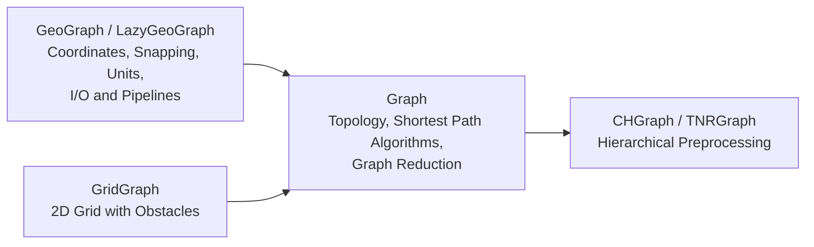
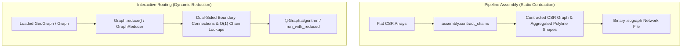
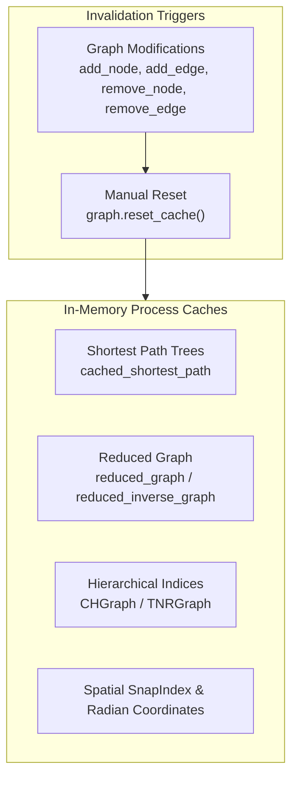

# scgraph — Architecture

Internal architecture and design of `scgraph`: query execution, data models, graph reduction systems, custom algorithm integration, caching lifecycle, and the `.scgraph` binary format.

For user-facing guides and examples, see the [README](README.md) and [API Documentation](https://connor-makowski.github.io/scgraph/scgraph.html). For development and contribution rules, see [DEVELOPMENT.md](DEVELOPMENT.md).

---

## Table of Contents

1. [Overview](#1-overview)
2. [Data Model](#2-data-model)
3. [Answering a Geographic Query](#3-answering-a-geographic-query)
4. [Graph Reduction](#4-graph-reduction)
5. [Adding an Algorithm](#5-adding-an-algorithm)
6. [Caches and Invalidation](#6-caches-and-invalidation)
7. [Network File Format](#7-network-file-format)

---

## 1. Overview


```mermaid
flowchart LR
    GEO["GeoGraph / LazyGeoGraph<br/>Coordinates, Snapping, Units,<br/>I/O and Pipelines"] --> G
    GRID["GridGraph<br/>2D Grid with Obstacles"] --> G
    G["Graph<br/>Topology, Shortest Path Algorithms,<br/>Graph Reduction"] --> CH["CHGraph / TNRGraph<br/>Hierarchical Preprocessing"]
```

`scgraph` separates topological graph algorithms from spatial and grid logic:

* **`Graph`**: Pure topological graph. Knows nothing about geography or coordinates. Implements core search algorithms (Dijkstra, Bidirectional Dijkstra, A\*, Bellman-Ford, BMSSP) and dynamic graph reduction. The *Algorithm Reference* of the [README](README.md#algorithm-reference) lists every algorithm with its use.
* **`GeoGraph` / `LazyGeoGraph`**: Holds a `Graph` (attribute `graph_object`) and adds geographic coordinates (WGS84 latitude/longitude), spatial snapping via `SnapIndex`, distance metrics, and multi-modal network support. `LazyGeoGraph` defers downloading and loading until the first query.
* **`GridGraph`**: 2D grid pathfinding with obstacle collision and configurable connectivity (4-way or 8-way).
* **`CHGraph` / `TNRGraph`**: Hierarchical acceleration structures (Contraction Hierarchies and Transit Node Routing) built from a `Graph` on demand.

### C++ Acceleration and Python Parity

All core graph operations exist in two mirrored implementations:
1. **C++ Extension (`scgraph/cpp/`)**: Compiled via nanobind with C++20 and `-O3`. Provides ~10x speedup on pathfinding and graph reduction.
2. **Pure Python Fallback**: Standard Python implementation with identical semantics, used automatically when the C++ extension is not compiled.

When `scgraph` is imported, it uses the C++ classes if the extension is compiled. Otherwise it uses the Python classes.

### Pipeline Subsystem (`scgraph.pipelines`)

The package `scgraph.pipelines` builds networks from their online sources. A pipeline is one module of this package. It names the sources of one network and has a `build` function. The docstring of `scgraph.pipelines` gives the contract of a pipeline. The guide [scgraph/pipelines/README.md](scgraph/pipelines/README.md) follows a network from its sources to a route: the build step by step, the derivation, the network release and the load, with the numbers of real runs.

The runner, `build.py`, runs a pipeline. `build_file` downloads the sources and calls `build` in a work folder. It writes the network to a `.scgraph` file, with the metadata of the build (pipeline, sources, software) in the header. Then it moves the file into the cache.

`derive.py` derives a network file from another network file, the parent file, with no download (`derive_file`). The derived file holds some modes of the parent file, and its land networks inside a bbox. Its header records the digest of the parent file.

A build runs steps. The functions of the steps are in `scgraph.pipelines.steps`, in four stages:

* **Stage 1, read the sources (`steps.stage1_extract`)**:
  `osm` reads the ways of an OpenStreetMap file, from disk or by HTTP byte ranges (`pbf_range_streamer`). `arcgis` downloads an ArcGIS layer. `osm.build_way_pieces` cuts each kept way into pieces and simplifies the shape of each piece to within 50 m (`assembly.simplify_shapes`, with `scgraph/helpers/douglas_peucker.py`).
* **Stage 2, join the modes (`steps.stage2_intermodal`)**:
  `hubs.join` joins the networks of several modes at hubs: ports, airports and rail terminals. `landmask` tells land from water on a Natural Earth raster, and finds the water path of a sea connector (`find_water_path_cells`).
* **Stage 3, assemble the graph (`steps.stage3_assembly`)**:
  `assembly.build_graph_from_pieces` stores the arcs as CSR arrays (`build_csr_from_arcs`). `assembly.assemble` keeps the strongly connected components (`strongly_connected_components`), contracts the chains of pass-through nodes (`contract_chains`), and numbers the nodes along a Hilbert curve.
* **Stage 4, validate the network (`steps.stage4_validation`)**:
  `validate_network` checks a built network against cases. A case describes a known route of the real world, such as a driving distance or a published sea distance. The docstring of `steps/stage4_validation` lists the kinds of cases and their rules. With `validate=True`, `build_file` validates the built file, and a network that fails does not enter the cache.

The costly functions of stages 2 and 3 have a C++ version in `scgraph/cpp/src/pipelines/` (`assembly.hpp`, `landmask.hpp`) and a pure-Python version that gives the same results.

---

## 2. Data Model

### In-Memory Graph Representation

`scgraph` stores a graph in two ways: an adjacency list in Python, and Compressed Sparse Row (CSR) arrays in C++.

#### 1. Conceptual View (Python Adjacency List)

In Python, a graph is represented as a list of dictionaries where each index corresponds to a source node ID:

```python
# graph[source_node] = {target_node: edge_weight, ...}
graph = [
    {1: 4.5, 2: 7.2},  # Node 0 connects to Node 1 (dist: 4.5) and Node 2 (dist: 7.2)
    {2: 2.1},          # Node 1 connects to Node 2 (dist: 2.1)
    {0: 7.2},          # Node 2 connects to Node 0 (dist: 7.2)
    {},                # Node 3 has no outgoing edges (dead-end or isolated node)
]
```

* **Directed Arcs**: Every connection is strictly directional. A two-way road between `A` and `B` is stored as two distinct opposite arcs: `graph[A][B] = w` and `graph[B][A] = w`.
* **Dense Node Numbering**: Nodes are identified by consecutive integers from `0` to `n - 1`. Every node has an entry in `graph`, even if it has no outgoing connections (`graph[u] = {}`).
* **Reverse Graph (`inverse_graph`)**: Bidirectional searches need to explore backward from the destination. The reverse structure `inverse_graph[v] = {u: weight}` is built lazily on demand when first queried.
* **Search View (`graph` vs `search_graph`)**:
  * `graph`: Always references the original, full-resolution network.
  * `search_graph`: The active structure traversed by search algorithms. When `graph.reduce()` is called to collapse long pass-through chains into shortcuts, `search_graph` switches to the compacted graph, while `graph` stays intact.

#### 2. C++ Engine (Compressed Sparse Row / CSR)

While Python dictionaries are flexible, allocating millions of small hash tables consumes excessive memory and degrades CPU cache locality on large networks.

In the C++ extension, [`CsrGraph`](scgraph/cpp/src/csr_graph.hpp) packs the entire topology into **three contiguous memory arrays**:

```
Node IDs:      0         1      2   3
Offsets:     [ 0,        2,     3,  4,  4 ]  (length: n + 1)
               │         │      │   │   │
               └──┬───┘  └──┬─┘ └─┬─┘ └─┴─ (Node 3 has 0 edges: 4 - 4 = 0)
                  ▼         ▼     ▼
Heads:       [ 1,   2,     2,     0   ]      (length: m = total arcs)
Weights:     [ 4.5, 7.2,   2.1,   7.2 ]      (length: m = total arcs)
```

* **How Edge Traversal Works**: To iterate over the outgoing arcs of node `u`, the engine reads `heads_[i]` and `weights_[i]` for indices $i \in [\text{offsets\_}[u], \text{offsets\_}[u + 1][$.
* **Zero-Copy Memory Mapping (`mmap`)**: When opening a `.scgraph` binary network file, `CsrGraph` directly references the mapped memory on disk without allocating or copying vectors.
* **Copy-on-Write Dynamic Updates**:
  * Because CSR arrays are immutable, dynamic edits (`add_node`, `add_edge`, `remove_edge`) are staged in a temporary hash map (`RowEdits`).
  * The next time a search query runs, all changes and untouched rows are repacked in a single pass into a fresh, contiguous `CsrGraph`.

### Geographic Attributes (`GeoGraph`)

`GeoGraph` layers spatial attributes on top of the base `Graph`:

* **`nodes`**: Node coordinates stored as `[latitude, longitude]` in degrees.
* **`node_ids`**: Stable identifiers from the source dataset (e.g. OpenStreetMap 64-bit node IDs). Nodes added dynamically receive negative IDs.
* **`node_modes`**: Byte array that gives the transport mode of each node, such as road, sea or port. Each node has one mode. The value is the row of that mode in `modes`, counted from 0.
* **`intermediate_nodes`**: Detailed polyline shapes for edges between network nodes: `intermediate_nodes[u][v] = [[lat, lon], ...]`.
* **Hilbert Curve Node Ordering**: Node arrays in `.scgraph` files are sorted along a 2D Hilbert curve. A network with several modes groups its nodes by mode first, in the order of `modes`, then sorts each group along the curve. Nodes that are geographically close share nearby indices, maximizing CPU cache locality and bounding-box search performance.

### Algorithm Query Interfaces

Search algorithms accept origin and destination in multiple formats:
* Single node ID: `int`
* Set of candidate node IDs: `set[int]`
* Dictionary of starting costs: `dict[int, float]` (used for multi-source starts and chain boundary entries)

Algorithms return a standardized dictionary:
```python
{"path": [node_0, node_1, ...], "length": total_path_cost}
```

### Trees and Hierarchies

Three algorithms of `Graph` prepare a structure once and then answer queries from it:

* **`cached_shortest_path`**: `get_shortest_path_tree(origin_id)` runs Dijkstra from one origin to every node. `get_tree_path` reads one path from that tree. `cached_shortest_path` keeps the tree of each origin, so a second query from the same origin runs no search.
* **`contraction_hierarchy`**: `create_contraction_hierarchy()` builds a `CHGraph` and stores it on the graph. The preprocessing contracts the nodes in order of importance and adds shortcut arcs. A query is a bidirectional Dijkstra search that only goes up in that order.
* **`tnr`**: `create_tnr_hierarchy()` builds a `TNRGraph`. A `TNRGraph` is a `CHGraph` with a set of transit nodes (the most important nodes) and a table of the distances between them. A long query reads the table instead of searching.

`contraction_hierarchy` and `tnr` build their hierarchy at the first query if it does not exist. A hierarchy can be saved and loaded (`save_as_chjson` / `CHGraph.load_from_chjson`, `save_as_tnrjson` / `TNRGraph.load_from_tnrjson`).

---

## 3. Answering a Geographic Query

When `GeoGraph.get_shortest_path` receives GPS coordinates, it runs five steps:


```mermaid
flowchart TD
    A["1. Input Coordinates<br/>Origin & Destination (lat, lon)"] --> B["2. Network Snapping<br/>Find nearest candidate node(s) via SnapIndex"]
    B --> C["3. Shortest Path Search<br/>Run graph algorithm on search_graph"]
    C --> D["4. Path Expansion<br/>Restore compressed chain nodes if reduced"]
    D --> E["5. Output Assembly<br/>Apply access circuity, format geometry and units"]
```

### 1. Input Coordinates
The origin and the destination are dictionaries with `latitude` and `longitude` in degrees.

### 2. Network Snapping (`SnapIndex`)
Spatial coordinates are snapped to the network using `SnapIndex`, an 8-ary spatial bounding-box tree:
* **Snapping Strategies (`node_addition_type`)**:
  * `'closest'`: Connects to the single nearest network node.
  * `'quadrant'`: Connects to the nearest node in each spatial quadrant (up to 4 candidates).
  * `'all'`: Connects to every network node within `node_addition_lat_lon_bound` degrees of latitude and of longitude of the point. If there is none, it connects to the nearest node.
* **Algorithmic Search Penalty (`node_addition_circuity`, default: 4)**:
  * When using `'quadrant'` or `'all'`, multiple candidate entry nodes exist.
  * During the pathfinding search, off-graph connection legs are artificially multiplied by `node_addition_circuity`.
  * This penalty prevents the search algorithm from "flying" off-network across impassable barriers (such as crossing land in a maritime network or crossing unbridged water) to reach a distant node.
  * It forces the route to enter the network at a nearby node.

### 3. Shortest Path Search
If the straight line from origin to destination is not longer than the shortest connection of either point to the network, `scgraph` returns the straight line and runs no search. Both lengths include `node_addition_circuity`.

The selected algorithm (default: `bidirectional_buckets`) runs from the origin candidates to the destination candidates:
* Searches operate on `search_graph` (the reduced graph if `reduce()` was called, otherwise the original graph).
* For `a_star`, great-circle lower bounds are computed using cached spherical radian coordinates. The search stops when, for the node taken from the queue, the distance from the origin plus the lower bound reaches the length of the best route found. With more than 4 destination candidates, it computes no lower bound and scans the nodes as Dijkstra does.
* A search that counts its node scans (README, *Logging*) stores the count for its thread when it ends (`_last_search_in_thread` in Python, `tl_node_scans` in C++). `GeoGraph.get_shortest_path` reads it for its DEBUG record.

### 4. Path Expansion
If the search ran on a reduced graph, any composite edges in the solution path are expanded back into their full underlying node sequence via `run_with_reduced`.

### 5. Final Distance and Geometry Assembly
* **Physical Distance Multiplier (`off_graph_circuity`, default: 1)**:
  * After the optimal path is identified, the algorithmic penalty is removed.
  * The actual access distances (origin $\to$ entrance node, and exit node $\to$ destination) are scaled by `off_graph_circuity` and added to the final reported route `length`.
  * Set to `1.0` for straight-line distance, `1.2` for urban street winding, or `0` for highway/maritime transit time.
* **Coordinate Output**: The full polyline geometry is assembled from `nodes` and `intermediate_nodes` in the requested format (`list_of_lists`, `list_of_dicts`, or GeoJSON).

---

## 4. Graph Reduction

Graph reduction replaces chains of non-branching nodes with direct composite edges of identical weight. This accelerates shortest-path queries without altering exact path lengths.

`scgraph` provides two distinct reduction systems designed for different phases of the lifecycle:


```mermaid
flowchart TD
    subgraph BuildTime["Pipeline Assembly (Static Contraction)"]
        A["Flat CSR Arrays"] --> B["assembly.contract_chains"]
        B --> C["Contracted CSR Graph & Aggregated Polyline Shapes"]
        C --> D["Binary .scgraph Network File"]
    end
    subgraph QueryTime["Interactive Routing (Dynamic Reduction)"]
        E["Loaded GeoGraph / Graph"] --> F["Graph.reduce() / GraphReducer"]
        F --> G["Dual-Sided Boundary Connections & O(1) Chain Lookups"]
        G --> H["@Graph.algorithm / run_with_reduced"]
    end
```

### Dynamic Query Reduction (`GraphReducer`)

Operates on an instantiated `Graph` via `graph.reduce(iterations=-1)`:

1. **Pass-through Detection**: Identifies degree-2 nodes where traffic flows through without choices (1 in / 1 out, or 2 bidirectional connections).
2. **Chain Grouping**: Groups contiguous pass-through nodes into chains (`reduced_node_chain_ids`).
3. **Boundary Connections**: Runs localized searches from every node to the nearest boundary nodes of its chain. This creates direct composite edges between boundary nodes, and connects interior chain nodes directly to chain boundaries.
4. **Transparent Query Routing (`run_with_reduced`)**:
   * **Both points outside chains**: Search runs directly on the reduced graph.
   * **Origin inside a chain**: Replaced by weighted edges to its chain's exit boundary nodes.
   * **Destination inside a chain**: Replaced by weighted edges from its chain's entry boundary nodes.
   * **Both inside the same chain**: Solved locally on the unreduced chain subgraph.
   * **Path Expansion**: `@Graph.algorithm` automatically expands composite edges back to original nodes.

---

### Static CSR Contraction (`assembly.contract_chains`)

Operates directly on flat C-style arrays during pipeline assembly:
* Takes `(offsets, heads, weights, node_modes, max_km_between_nodes, arc_classes)` and returns a `ContractedGraph` namedtuple:
  * `kept`: Indices of retained nodes.
  * `origins`, `heads`, `weights`: Compressed composite edges.
  * `member_offsets`, `members`: Indices of original input arcs forming each composite edge.
* `node_modes` is optional. A chain is never contracted across two modes.
* `arc_classes` is optional: the class of each arc. The header of `assembly.py` gives its rule.
* `max_km_between_nodes` cuts a chain into segments of about that length (default: no cut).
* A segment that would create a self-loop or a duplicate arc is split at its midpoint.
* The aggregated geometry is generated by `build_chain_shapes` using `members`.

---

## 5. Adding an Algorithm

Custom algorithms plug into `Graph` using the `@Graph.algorithm` decorator:

```python
from scgraph import Graph

@Graph.algorithm(bidirectional=False)
def my_search(graph, origin_node, destination_node, **kwargs):
    # graph.search_graph provides the active graph (reduced or unreduced)
    adjacency = graph.search_graph
    
    # origin_node and destination_node can be:
    # - int (single node)
    # - dict {node_id: starting_distance} (boundary entries on reduced graphs)
    ...
    return {"path": [origin_id, ..., destination_id], "length": total_cost}
```

### Decorator Guarantees
* **Reduced Graph Support**: When the graph is reduced, `@Graph.algorithm` intercepts calls, converts chain-interior endpoints into boundary node dictionaries, executes the search on `search_graph`, and expands the returned path back to original nodes.
* **Bidirectional Searches**: Setting `bidirectional=True` also exposes `graph.search_inverse_graph`.
* **Zero Overhead**: On unreduced graphs, the decorated function executes directly without indirection.

---

## 6. Caches and Invalidation

`scgraph` manages caching at both the process level (RAM) and filesystem level (Disk).


```mermaid
flowchart TD
    subgraph RAM["In-Memory Process Caches"]
        T["Shortest Path Trees<br/>cached_shortest_path"]
        R["Reduced Graph<br/>reduced_graph / reduced_inverse_graph"]
        H["Hierarchical Indices<br/>CHGraph / TNRGraph"]
        S["Spatial SnapIndex & Radian Coordinates"]
    end
    subgraph Triggers["Invalidation Triggers"]
        M["Graph Modifications<br/>add_node, add_edge, remove_node, remove_edge"]
        C["Manual Reset<br/>graph.reset_cache()"]
    end
    M --> C
    C --> RAM
```

### In-Memory Cache Invalidation
Calling `reset_cache()`, or modifying topology via `add_node`, `remove_node`, `add_edge`, or `remove_edge`, invalidates:
* Cached shortest-path trees (`cached_shortest_path`).
* Reduced graph structures and chain mappings.
* Contraction Hierarchies (`CHGraph`) and Transit Node Routing (`TNRGraph`).
* The geographic snapping index (`snap_index`) and spherical radian coordinates.

The `inverse_graph` is preserved across edits and updated incrementally.

### Persistent Filesystem Cache (`SCGRAPH_CACHE_DIR`)

Networks built or downloaded by `scgraph` are cached on disk (default: `~/.cache/scgraph`):
* **Hierarchy**: `networks/<name>/<region>/<content_sha256>.scgraph` next to a `cache.json` that names the file and gives the download time.
* **Network Releases**: `releases/<tag>/<name>.scgraph` is a network file that `load_geograph` downloaded from the network release `<tag>`. `<name>.no_shapes.scgraph` is the same network without arc shapes. A file gets this name only after its content is checked, so a later load does not check it again. The guide [scgraph/pipelines/README.md](scgraph/pipelines/README.md), Part 4, shows the steps of a load.
* **Atomic Writes**: A build writes into its work folder: `.work/<name>/<region>` of the cache directory, or the `work_dir` of the caller. It then moves the finished `.scgraph` file into the cache. The file arrives beside its final place and takes its name in one step. `cache.json` is written the same way, after the file. `cache.json` therefore always names a whole file. A build that succeeds removes its work folder. A build that fails keeps its work folder, with the downloaded sources. The next build resumes from it. `refresh=True` empties it first.
* **Offline Operation**: Setting `SCGRAPH_OFFLINE=1` or `local_files_only=True` prevents all network requests, loading only existing cached builds.
* **Cache Management**: `GeoGraph.clear_geograph_cache()` safely removes cached networks without altering user files.

---

## 7. Network File Format

The `.scgraph` binary format stores network topologies, spatial coordinates, and metadata in a single self-contained file with zero external dependencies.

This section specifies `format_version` 1. A file built by `build_geograph` also records the version of scgraph that built it, in `metadata.software.scgraph`. For a released version, this section at the tag of that release is the specification that applies to the file.

### Design Principles

1. **Zero-Copy Memory Mapping**: In the C++ backend, `.scgraph` files are mapped directly into process memory (`mmap`). Graph algorithms read CSR arcs directly from disk pages without deserialization or copying.
2. **Deterministic Content Addressing**: Bytes `8..39` contain the SHA-256 digest of the entire file payload (from byte 40 to end). Two builds from identical sources, software, and platforms produce byte-identical files.
3. **Attribution and Provenance Preservation**: The JSON header preserves dataset licenses, attribution requirements, pipeline versions, and build metadata.

---

### Binary File Layout

All multi-byte integers are stored in **little-endian** byte order:

| Byte Offset | Size | Type | Name | Description |
| :--- | :--- | :--- | :--- | :--- |
| `0 .. 7` | 8 bytes | ASCII | Magic Bytes | Constant magic identifier: `SCGRAPH1` |
| `8 .. 39` | 32 bytes | Binary | Content SHA-256 | Raw SHA-256 hash of all bytes from offset 40 to EOF |
| `40 .. 47` | 8 bytes | uint64 | Header Length | Byte length of the unpadded JSON header ($L_H$) |
| `48 .. 48 + L_H - 1` | $L_H$ bytes | UTF-8 | Header JSON | UTF-8 JSON text with sorted keys (`json.dumps(header, sort_keys=True)`) |
| Next | $0 .. 63$ bytes | Zeros | Padding | Zero padding up to the next 64-byte boundary |
| Array Section | Variable | Binary | Contiguous Arrays | Data arrays, each aligned to a 64-byte boundary |

---

### Header JSON Schema

The header contains top-level structural fields and a nested `metadata` dictionary. The values below are examples:

```json
{
  "format_version": 1,
  "arrays": {
    "offsets": {"dtype": "int32", "shape": [10001], "offset": 0},
    "heads": {"dtype": "int32", "shape": [25000], "offset": 40064},
    "weights": {"dtype": "float64", "shape": [25000], "offset": 140096},
    "node_points": {"dtype": "int32", "shape": [10000, 2], "offset": 340096}
  },
  "metadata": {
    "crs": "EPSG:4326",
    "units": "km",
    "symmetric": false,
    "node_order": "hilbert",
    "pipeline": {
      "name": "osm_main_roads",
      "region": "europe/luxembourg",
      "version": 1
    },
    "software": {
      "scgraph": "<version>",
      "backend": "cpp",
      "platform": "linux-x86_64 glibc 2.36"
    },
    "sources": [
      {
        "name": "roads",
        "url": "https://download.geofabrik.de/europe/luxembourg-latest.osm.pbf",
        "sha256": "...",
        "bytes": 35600000,
        "license": "ODbL-1.0",
        "credit": "© OpenStreetMap contributors",
        "version": "2026-11-07T21:21:36Z"
      }
    ]
  }
}
```

#### Header Fields Specification

| Field | Type | Description |
| :--- | :--- | :--- |
| `format_version` | `int` | Format specification version (currently `1`). See *Compatibility Between Versions* for when it changes. |
| `arrays` | `dict` | Map of array names to their `dtype`, `shape`, and byte `offset` (relative to the end of the padded header). |
| `metadata.crs` | `str` | Coordinate reference system (standard: `EPSG:4326`). |
| `metadata.units` | `str` | Distance units of edge weights (`km`, `m`, `mi`, `ft`). |
| `metadata.symmetric` | `bool` | Whether the graph's CSR topology is bidirectional with identical forward and reverse weights. |
| `metadata.node_order` | `str` | How the nodes are numbered. `"hilbert"`: along a 2D Hilbert space-filling curve. With several modes, the nodes are grouped by mode first, in the order of `metadata.modes`, then numbered along the curve within each mode. A read of one mode (`load_from_scgraph(modes=...)`) relies on this order. |
| `metadata.modes` | `list[dict]` | The transport modes of the network. Each mode is a dict. `name` gives the name of the mode. When a source gave the node ids of the mode, `source` holds the name of that source in `sources`. A network with one mode has no `node_modes`: all its nodes are in that mode. If that mode has no name, the file has no `modes`. |
| `metadata.classes` | `list[str]` | Only in a file with `arc_classes`: the names of the classes (docstring of `scgraph.pipelines`, *The classes*). |
| `metadata.pipeline` | `dict` | The pipeline that built the file: its name, the region, and its `PIPELINE_VERSION`. |
| `metadata.software` | `dict` | Build environment provenance: `scgraph` version, `backend` (`cpp` or `python`), and host platform (e.g. `linux-x86_64 glibc 2.36` or `macOS 14.5`). |
| `metadata.sources` | `list[dict]` | Data sources with attribution, licenses, URLs, file digests, and data timestamps. |
| `metadata.derivation` | `dict` | Only in a file that `scgraph.pipelines.derive` derived from another network file: the `parent_content_sha256`, and the `modes`, the `bbox` and the `min_component_nodes` of the derivation. Such a file has no `metadata.description`. |

---

### Stored Binary Arrays

A **point** is a place, given as one `[latitude, longitude]` pair. Its **coordinates** are its latitude and its longitude. A coordinate is one of these two numbers. A **node** is a vertex of the graph, numbered from `0` to $N - 1$. Its position is a point. The points of an arc between its two nodes are its **shape points**. They are not nodes: the search never visits them. The attribute `GeoGraph.intermediate_nodes` holds the shape points of each arc. `node_points` and `shape_points` are arrays of points: the latitude of a point, then its longitude. A file has $N$ nodes, $M$ arcs and $K$ shape points.

The latitude comes first, as in the axis order of `EPSG:4326`. GeoJSON uses the opposite order: `save_as_geojson` writes the longitude first. A latitude is from -90 to 90 degrees, and a longitude from -180 to 180 degrees (`GeoGraph.validate_nodes` checks both).

All arrays are stored as raw, contiguous C-order binary buffers aligned to 64 bytes:

| Array Name | Data Type | Dimensions | Description |
| :--- | :--- | :--- | :--- |
| `offsets` | `int32` | $N + 1$ | CSR row index. Arcs originating from node $u$ span index `offsets[u]` to `offsets[u+1] - 1`. |
| `heads` | `int32` | $M$ | The destination node of each arc, from `0` to $N - 1$. |
| `weights` | `float64` | $M$ | Cost / length of each arc. |
| `node_points` | `int32` or `float64` | $N \times 2$ | The latitude then the longitude of each node. If `int32`, a value is in units of $10^{-7}$ degree: degrees = value / $10^7$ (~1 cm precision). |
| `shape_offsets` *(opt)* | `int32` | $M + 1$ | Slice index into `shape_points` for detailed arc polylines. |
| `shape_points` *(opt)* | `int32` or `float64` | $K \times 2$ | The latitude then the longitude of each interior arc point, in the dtype of `node_points`. |
| `node_ids` *(opt)* | `int32` or `int64` | $N$ | Original source identifiers (e.g. OSM 64-bit node IDs). |
| `node_modes` *(opt)* | `uint8` | $N$ | The mode of each node: the row of its mode in `metadata.modes`, counted from 0. Each node has one mode, so the value is an index, not a set of bits. A file has at most 256 modes. |
| `arc_classes` *(opt)* | `uint8` | $M$ | The class of each arc: the row of its class in `metadata.classes`, counted from 0. A file has at most 256 classes. |

For example, `world_main_roads_and_marnet` has three modes:

```json
"modes": [
  {"name": "road", "source": "roads"},
  {"name": "port", "source": "ports"},
  {"name": "sea", "source": "sea"}
]
```

Its road nodes have the value `0` in `node_modes`, its ports `1` and its sea nodes `2`. The road nodes come first, then the ports, then the sea nodes. Each mode names its source. The id of a port node is its World Port Index number, from the table `ports`.

A pipeline may record the class of each arc in `arc_classes`. A program reads the name of a class from the header of the file. A later version of scgraph may give a class another row.

### Coordinate Encoding (`int32` vs `float64`)

`scgraph` supports two coordinate encodings:
* **`float64`**: Full 64-bit IEEE 754 precision (exact).
* **`int32` ($10^{-7}$ degrees)**: OpenStreetMap's fixed-point encoding (about 1.1 cm at the equator). A coordinate takes 4 bytes instead of 8.

### How scgraph Reads a File

The function `network_file.read` reads a network file. It makes these checks, in this order. If a check fails, it raises a `ValueError`.

1. The first 8 bytes are `SCGRAPH1`.
2. The header is inside the file. The header is valid JSON.
3. `format_version` is `1`. scgraph reads only this version. For another version, the error message gives the version of the file.
4. For each array that scgraph knows:
   - the dtype is one of the dtypes that the table above allows;
   - the offset is zero or more;
   - the start of the array is a multiple of 64 bytes;
   - the end of the array is inside the file.
5. The file has all the arrays that the table does not mark *(opt)*. The file has both `shape_offsets` and `shape_points`, or neither. The arrays have the correct lengths:
   - `offsets` has $N + 1$ values. The first value is `0`, and the last value is $M$.
   - `weights` has $M$ values.
   - If the file has `shape_offsets`, it has $M + 1$ values. The first value is `0`, and the last value is the number of points in `shape_points`.
   - Each node has one point. If the file has `node_ids` or `node_modes`, each node also has one id or one mode.
   - If the file has `arc_classes`, each arc has one class.

   `node_points` and `shape_points` have the same dtype. If the file has `node_modes`, `metadata.modes` is a list. If the file has `arc_classes`, `metadata.classes` is a list.
6. If `read` copies the arrays into memory, it also checks each value:
   - the values of `offsets` do not decrease;
   - each head is a node;
   - the values of `shape_offsets` do not decrease;
   - each value of `node_modes` is a row of `metadata.modes`;
   - each value of `arc_classes` is a row of `metadata.classes`.

   `read` maps the file into memory instead of copying it when its caller passes `mapped=True`, on a little-endian computer. In the C++ build, `load_from_scgraph` always maps the file. A mapped read does not check the values. The C++ graph checks the offsets and the heads when it is built.

If `read` gets `modes`, it keeps only the nodes of these modes and the arcs between them. It first checks that each name is in `metadata.modes`. The function `select_arcs` then visits each arc of the kept nodes once. `scgraph/cpp/src/arc_selection.hpp` explains this function, and `scgraph/helpers/arc_selection.py` is its pure-Python version. `select_arcs` checks each value that it reads, as step 6 does, and it checks that the values of `node_modes` do not decrease. It writes new `offsets`, `heads` and `shape_offsets`, because their values change. Every other array keeps its values. A mapped read takes these values in place when they are consecutive in the file, and copies them otherwise. Each kept arc keeps its class, and `metadata.classes` stays the whole list.

`read` does not check the digest in bytes 8 to 39 (`content_sha256`). scgraph uses the digest as the name of a cached file. `network_file.check_content` computes the digest again, to find a file that was cut or changed after it was written. `load_geograph` calls it once, after a download.

### Compatibility Between Versions

A later version of scgraph can add an optional array or a metadata key, and keep `format_version` at `1`. An earlier version that reads `format_version` 1 still reads such a file, for two reasons:

- `read` ignores an array whose name it does not know.
- `read` keeps all the keys of `metadata`, including the keys that it does not know. `GeoGraph.get_scgraph_info` returns all these keys.

`format_version` changes when an earlier version of scgraph would refuse a file or read it incorrectly. Examples: a new array that the graph needs, or a new meaning for the values of an existing array.
